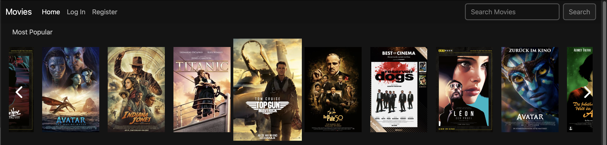
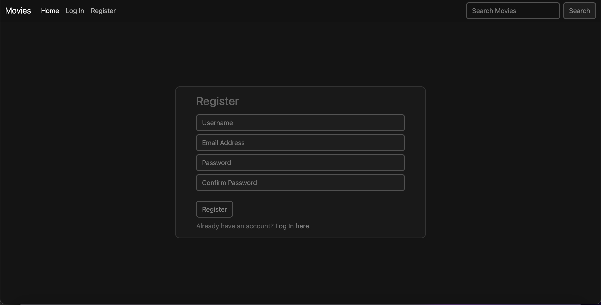
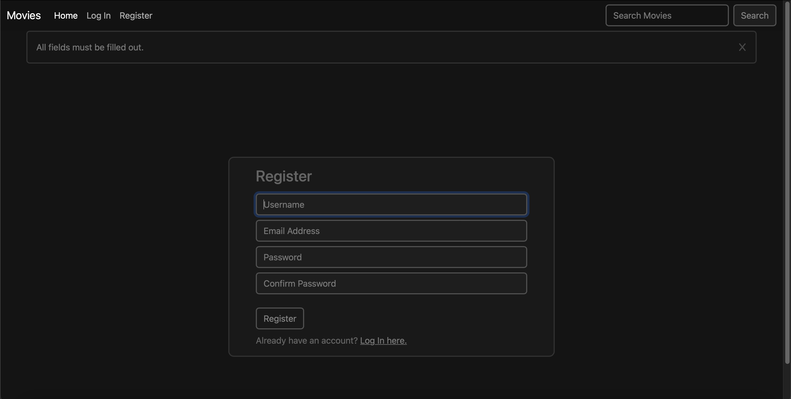
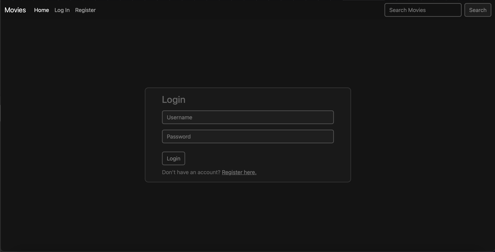
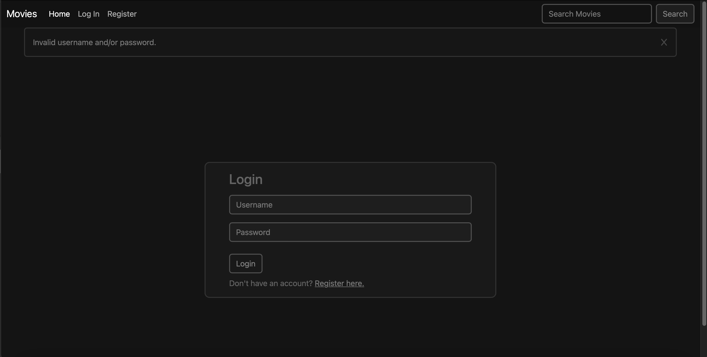
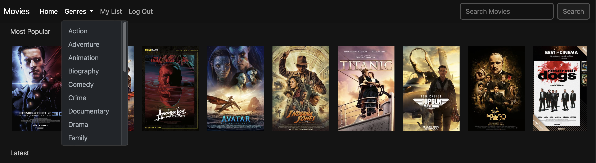

# Movies platform

## Movies platform project description

This project was written by using Python, Django, JavaScript, HTML, while Bootstrap and CSS were used for styling.
It represents a movies site where users can see movies' information, trailers, add movies to their list if they are registered. 
They can see movie's directors, producers, cast as well as information about them. They can also see movies by their genres as well as search for them.

## *Home* page
*Home* page is the main page and you can access it regardless of user being logged in or not.
It displayes three rows of movies, Most popular, Latest, and third row are movies by genre that is randomly selected each time.

Each row is horizontally scrollable. Right arrow appears when mouse moves on row, and disappears when it gets out of row, as well as when there isn't left any space to scroll further right.
Left arrow appears if scrolling to the right has occured and if mouse is on row. It disappears when mouse moves out of row and where there isn't any space to scroll to left.

## *Register* page
*Register* page is the page where users can register their accounts.

If user doesn't fill out all form inputs or if some are not valid, a disposable pop-up message appears.

## *Login* page
*Login* page is the page where registered users can log into their accounts.

If user doesn't fill all form inputs or if some of them are incorrect, a disposable pop-up message appears.

## *Genres* page
When user is logged in, one of the available pages is *Genres* page. *Genres* icon in *Navbar* is a drop-down list with all the genres.

By clicking on one of the genres, we are taken to the page that displays all the movies with that genre.

If there are, 45 movies are sent through Paginator to each page.

When user clicks on a particular movie, it is taken to a page of that movie where some additional data is displayed like movie summary (summary is in German bacuse data source is in German), movie genres, movie duration, IMDb rating, director, producers, cast. 

If there is one, user can also see the trailer for that movie. When user clicks on *Watch the trailer*, a pop-up box with the trailer appears in the center of the screen.

By clicking on the director's name, producers' names or cast names, a pop-up box with image and some additional information for each pearson appears in the center of the screen.

At the 
